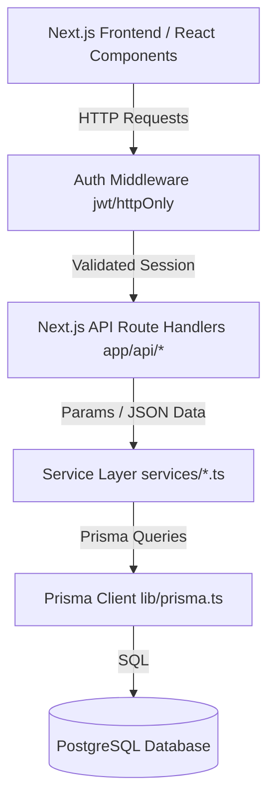

# ANUJNA – Practical Implementation Roadmap (v1.0)

**Document ID:** ANJ-IMP-v1.0  
**Project:** ANUJNA – Consent-Driven Unified Health Identity Platform  
**Target Audience:** Development Team / Computer Engineering Student Portfolio  
**Status:** Baseline Plan  

---

## 1. Minimal High-Level Architecture

The architecture follows a lightweight **Service-Layer Pattern** built on **Next.js App Router (React Server Components + API Route Handlers)**. It enforces a strict separation of concerns, ensuring that HTTP request-handling code is isolated from core healthcare business rules.



### Core Architecture Components:
1. **Next.js App Router API Routes:** Act as controllers. They receive HTTP requests, parse queries, run initial validations, and pass control to domain services.
2. **Service Layer (Domain Logic):** Standard TypeScript classes or functions containing the core platform rules (e.g., matching record scopes, checking if a consent has expired, generating unique health IDs).
3. **Database Client (Prisma):** Interacts with PostgreSQL using the frozen `schema.prisma`.
4. **JWT Verification Middleware:** A middleware layer that checks for a secure `HttpOnly` session cookie before routing requests to protected API endpoints.

---

## 2. Project Folder Structure

We organize the code under the `06_Implementation/app/` subdirectory to separate application development logic from requirements and design documentation.

```text
ANUJNA/
├── 01_PVD/                       # Product Vision Document
├── 02_SRS/                       # Software Requirements Specification
├── 03_System_Analysis/           # System Use Cases and RBAC models
├── 04_System_Design/             # System Domain Model & diagrams
├── 05_Database/                  # Database Design
│   ├── Prisma/
│   │   └── schema.prisma         # Frozen Prisma schema file
│   └── Relational_Schema/
│       └── ANJ-LDD-v1.1.md       # Logical Database Design spec
├── 06_Implementation/            # Code Implementation Folder
│   ├── ANJ-Implementation-Roadmap.md # This Roadmap
│   └── app/                      # Next.js Application Root
│       ├── src/                  # Next.js source root
│       │   ├── app/              # App Router Pages & API Route Handlers
│       │   │   ├── api/          # Route controllers (API endpoints)
│       │   │   └── ...           # Frontend page UI layouts
│       │   ├── components/       # Reusable React UI components
│       │   ├── lib/              # Database Client & Shared Helpers
│       │   │   ├── prisma.ts     # Global Prisma Client instance
│       │   │   └── test-db.ts    # DB connectivity test script
│       │   ├── services/         # Isolated Domain Business Logic Services
│       │   └── types/            # Custom TypeScript typings
│       ├── prisma.config.ts      # Prisma 7+ local configuration
│       ├── package.json          # Node dependencies
│       └── tsconfig.json         # TypeScript config
└── 07_Testing/                   # Test suite documentation and reports
```

---

## 3. Module Boundaries

To prevent dependency cycles and maintain a maintainable codebase:
* **HTTP/Next.js Layer (`app/`):** Must **never** query Prisma directly. It only calls functions in the Service Layer.
* **Service Layer (`services/`):** Receives primitive values or type-safe parameters (no raw Request objects). It calls the Prisma client, queries the database, and returns clean response objects.
* **Shared Layer (`lib/`):** Global configurations and database instantiations. Services may call lib wrappers, but lib wrappers must not import service logic.

---

## 4. Authentication Design

For a production-ready student portfolio, we use a secure, custom **JWT + HttpOnly Cookie** implementation:

1. **Hashing:** Password encryption is handled during registration via `bcryptjs`.
2. **Token Payload:** The JWT includes:
   ```json
   {
     "userId": "uuid-string",
     "email": "user@example.com",
     "roles": ["Patient", "Doctor"]
   }
   ```
3. **Transmission:** Tokens are signed using a HS256 secret key and sent via `Set-Cookie` header with the following parameters:
   * `HttpOnly` (Prevents client-side JS from reading the cookie, stopping XSS-based theft).
   * `Secure` (Ensures the cookie is only sent over HTTPS).
   * `SameSite=Strict` (Blocks CSRF request context transmission).
   * `Path=/` (Cookie is active for all routes).
4. **Session Extraction:** A utility in `lib/auth.ts` extracts and verifies the cookie during Next.js middleware routing or API route handler calls.

---

## 5. Authorization Strategy (RBAC + Consent)

Authorization is checked at two stages:

### 5.1 Role-Based Access Control (RBAC)
Checked by inspecting the roles list inside the verified JWT session:
```typescript
// Example permission wrapper in Services
if (!session.roles.includes("Doctor")) {
  throw new Error("UNAUTHORIZED: Requires Doctor role.");
}
```

### 5.2 Consent-Based Access
When a doctor tries to read records, the `ConsentService` evaluates authorization dynamically:
1. Check if the doctor's profile is verified (`isVerified == true`).
2. Search the `Consent` table for an `ACTIVE` status record where:
   * `accessRequest.doctorProfileId == doctorProfileId`
   * `accessRequest.patientProfileId == targetPatientProfileId`
   * `current_timestamp` falls in `[start_date, end_date]`
3. Evaluate the scope constraints:
   * **`ALL`:** Allow retrieval of all patient records.
   * **`CATEGORY`:** Compare record types. Only return records matching `Consent.record_type`.
   * **`INDIVIDUAL`:** Validate that the requested record ID is mapped in `ConsentHealthRecord` for this `consent_id`.

---

## 6. API Resource Design

| Endpoint | Method | Role Allowed | Request Body | Description |
| :--- | :--- | :--- | :--- | :--- |
| `/api/auth/register` | `POST` | Public | `{ email, password, fullName, roleName, ... }` | Onboards a user and creates profile. |
| `/api/auth/login` | `POST` | Public | `{ email, password }` | Authenticates user and sets HttpOnly cookie. |
| `/api/auth/logout` | `POST` | All | - | Clears the session cookie. |
| `/api/doctors/verify` | `POST` | Doctor | `{ registrationNumber }` | Submits onboarding credentials. |
| `/api/doctors/requests`| `GET` | Admin | - | Lists pending doctor verifications. |
| `/api/doctors/requests/[id]/review` | `POST` | Admin | `{ approve: boolean }` | Approves/rejects doctor status. |
| `/api/patients/lookup` | `GET` | Doctor | `?healthId=ANJ...` | Checks patient profile details. |
| `/api/records` | `GET` | Patient, Doctor | - | Lists owned or authorized records. |
| `/api/records` | `POST` | Patient, Lab | Multipart file upload | Uploads a new record file and metadata. |
| `/api/requests` | `POST` | Doctor | `{ patientProfileId, purpose, requestedScopeType, requestedCategory }` | Submits access request. |
| `/api/requests` | `GET` | Patient, Doctor | - | Lists incoming requests (Patient) or outgoing requests (Doctor). |
| `/api/requests/[id]/consent`| `POST` | Patient | `{ scopeType, recordType, startDate, endDate, recordIds[] }` | Approves request and grants consent. |
| `/api/requests/[id]/reject` | `POST` | Patient | - | Rejects the doctor's request. |
| `/api/consents` | `GET` | Patient | - | Displays active and historical consents. |
| `/api/consents/[id]/revoke` | `POST` | Patient | - | Terminates active consent immediately. |
| `/api/emergency/override` | `POST` | Emergency | `{ patientProfileId, justification }` | Initiates override access. |
| `/api/audit` | `GET` | Auditor | - | Retrieves immutable security logs. |

---

## 7. Implementation Roadmap & Commit Milestones

### Phase 1: Project Bootstrap
Initialize the project environment, package versions, and Prisma integration.
* **Tasks:**
  1. Initialize Next.js project with Tailwind CSS and TypeScript.
  2. Setup `.env` and load database credentials.
  3. Install `@prisma/client`, `bcryptjs`, `jose` (for JWT parsing), and `lucide-react`.
  4. Place frozen `schema.prisma` in `src/prisma/schema.prisma` and create root `prisma.config.ts`.
  5. Run `npx prisma db push` (or generate initial migration script) to configure the local PostgreSQL database.
  6. Instantiate Prisma Client in `src/lib/prisma.ts`.
* **Git Milestone Commit:** `feat(setup): bootstrap next.js project, prisma configuration, and db connection`

### Phase 2: Authentication Module
Implement base User registration, cookie-based session management, and role routing.
* **Tasks:**
  1. Implement JWT generation, cookie writing, and payload parsing inside `src/lib/auth.ts`.
  2. Write API routes `/api/auth/register` (hashing password via bcrypt) and `/api/auth/login`.
  3. Write a simple API middleware wrapper verifying the session token.
  4. Create landing page UI with forms for User login and registration.
* **Git Milestone Commit:** `feat(auth): complete secure registration, login with HttpOnly JWT, and session parsing`

### Phase 3: Patient Module
Manage patient-specific identities and profile updates.
* **Tasks:**
  1. Implement PatientProfile model records generation during registration.
  2. Write unique ANUJNA Health ID generation logic (e.g. `ANJ-YY-xxxxxx`) in `src/services/authService.ts`.
  3. Implement `src/app/api/patients/lookup` to allow lookup checks via Health ID.
  4. Build the patient profile dashboard front-end display.
* **Git Milestone Commit:** `feat(patient): generate health identity identifiers and build lookup API`

### Phase 4: Health Record Module
Support file uploading, metadata categorizations, and file downloads.
* **Tasks:**
  1. Implement storage mockup helper in `src/lib/storage.ts` (writes uploaded files locally or references virtual cloud paths).
  2. Build `/api/records` POST handler to accept file uploads, populate `HealthRecord` attributes, and track the uploader ID.
  3. Implement `/api/records` GET handler filtering out records that have `deletedAt` populated (soft deletion).
  4. Build UI components for record upload forms and record tables.
* **Git Milestone Commit:** `feat(records): support document uploads, record type categorization, and soft deletes`

### Phase 5: Consent Module
Allow patients to configure access rules, scopes, and durations.
* **Tasks:**
  1. Implement `src/services/consentService.ts` to manage consent creation, scopes, and category validations.
  2. Write `/api/consents` listing views.
  3. Implement `/api/consents/[id]/revoke` to update consent status and stamp soft-deletion attributes.
  4. Build Patient Consent Management UI.
* **Git Milestone Commit:** `feat(consent): implement consent creation, scope definitions, and manual revocation`

### Phase 6: Doctor Access Workflow
Enable the request-review-access lifecycle between doctor and patient profiles.
* **Tasks:**
  1. Implement DoctorProfile submit form and `/api/doctors/verify` request submission.
  2. Build Administrator view to approve doctor verification requests (sets `isVerified` on doctor profiles to `true`).
  3. Build `/api/requests` for doctors to submit record access requests.
  4. Build Patient Request Review dashboard. Approving the request creates a matching `Consent` record.
  5. Enforce dynamic authorization check on `/api/records` when a Doctor accesses patient records.
* **Git Milestone Commit:** `feat(doctor-workflow): complete request-consent pipeline and verified access enforcement`

### Phase 7: Emergency Access Workflow
Support audited override permissions during medical emergencies.
* **Tasks:**
  1. Create `/api/emergency/override` accepting patient identification and provider justification.
  2. Map custom database override logs using `EmergencyAccessEvent` and `EmergencyAccessRecord`.
  3. Build UI display for Emergency Override form.
  4. Implement temporary emergency session validation (e.g., access expires automatically after 4 hours).
* **Git Milestone Commit:** `feat(emergency): support audited policy override and time-bound emergency access`

### Phase 8: Audit and Notifications
Provide transparency dashboards, notifications, and immutable logging.
* **Tasks:**
  1. Build a generic helper in `src/services/auditService.ts` to create append-only `AuditLog` entries with IP and user-agent context.
  2. Insert audit logging calls in registration, login, record views, consent changes, and emergency overrides.
  3. Write logic to trigger alerts in `Notification` table during key lifecycle events.
  4. Create Security Auditor Dashboard listing system-wide logs and dashboard notifications for patients.
* **Git Milestone Commit:** `feat(audit): implement immutable audit trails, client metadata logging, and notifications`

### Phase 9: Testing and Deployment
Verify and compile the project for local testing and cloud deployment.
* **Tasks:**
  1. Write basic integration tests for Auth, upload, and consent checks.
  2. Validate production builds locally using `npm run build`.
  3. Set up Vercel project and configure PostgreSQL environment variables.
  4. Execute migrations on the Vercel PostgreSQL database and deploy app.
* **Git Milestone Commit:** `test(ci): finalize testing, compile build, and prepare for vercel release`
